# 🚀 Maverick Start Program — Engineering Pre-Assessment

**Sacco** is a project whose target audience is users in a sacco setting, they can transact, deposit, transfer funds from one user to another using a wallet with a unique username, allowing users to own a wallet and use it in their day to day transactions.

---
**Target Audience**

Community groups / Sacco

---

# Feature List

# User Registration

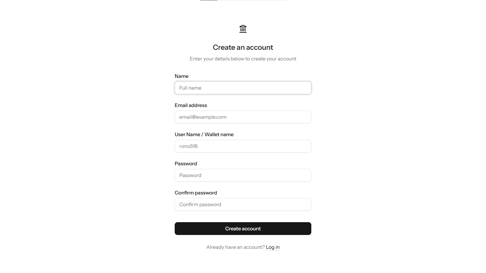

# User Login

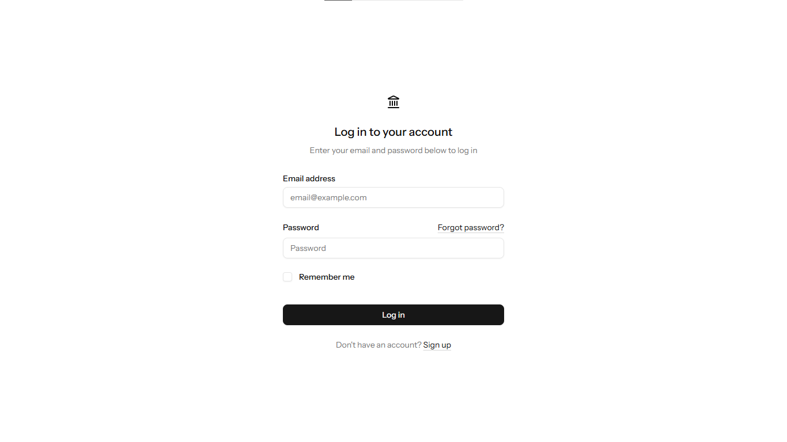

# Dashboard , Wallet overview, Transactions & Savings Balances, Transactions history

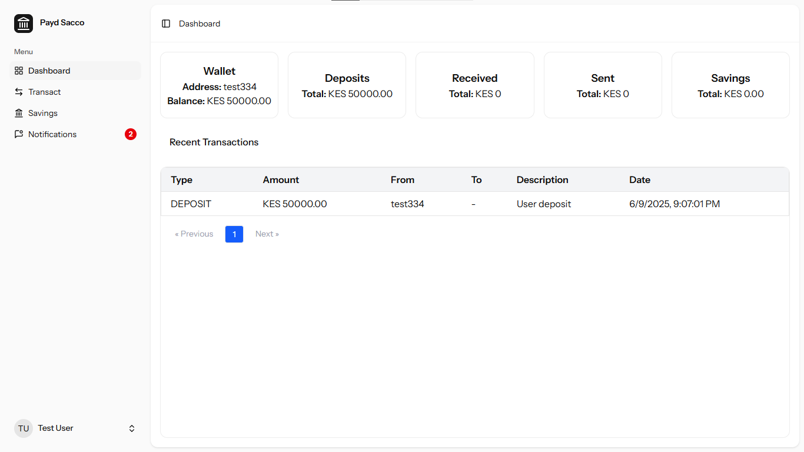

# Transaction Page for Deposit , Wallet to Wallet transfer

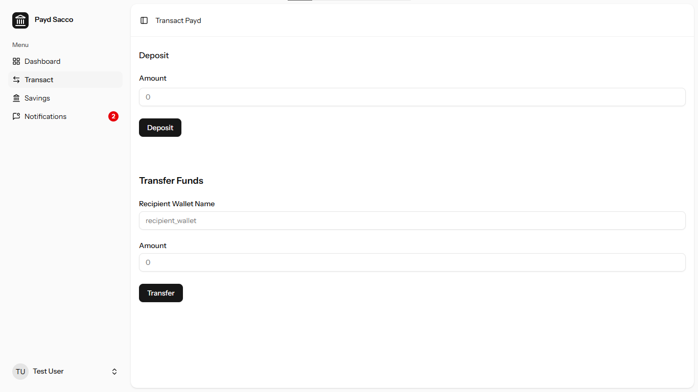

# Savings Overview , Balance , Target & Progress

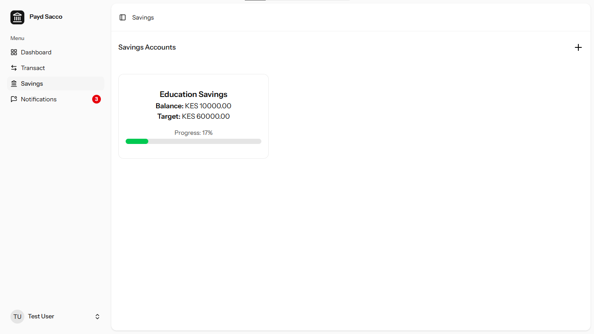

# Create New Savings, Target, Description

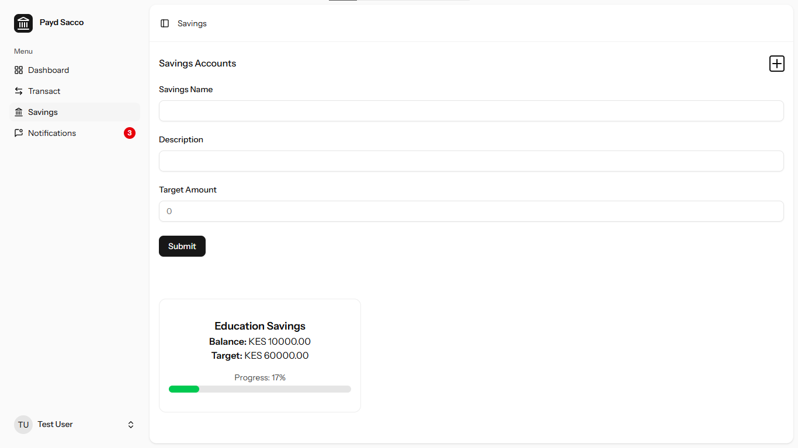

# Wallet to Savings Transfer

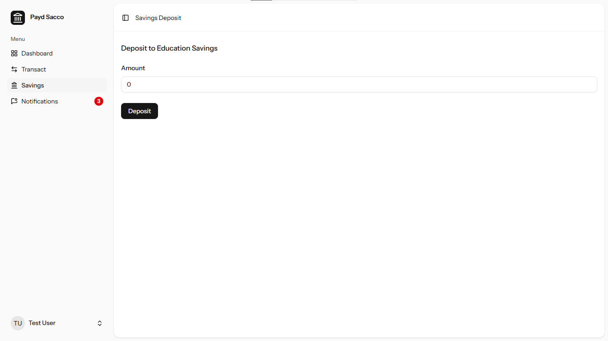

# Notifications on deposits, transfers, received transactions , new savings account

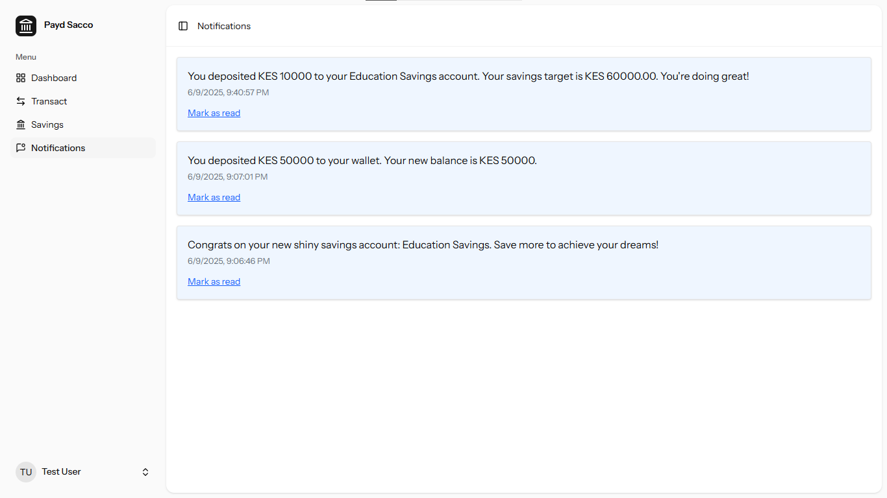

# Profile Update, Password Management, Light/Dark Theme toggle

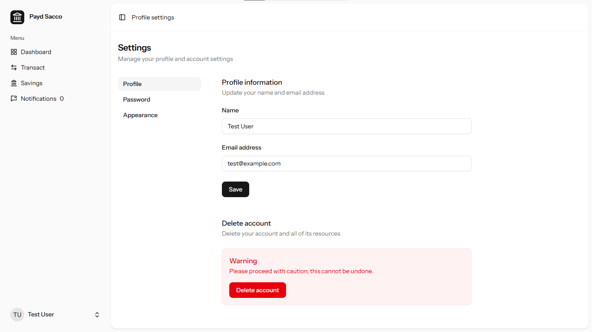

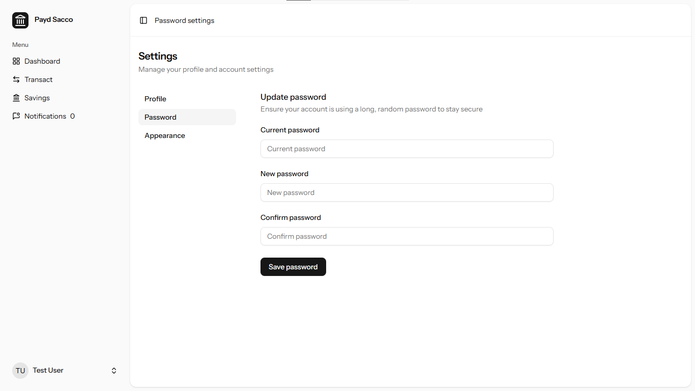

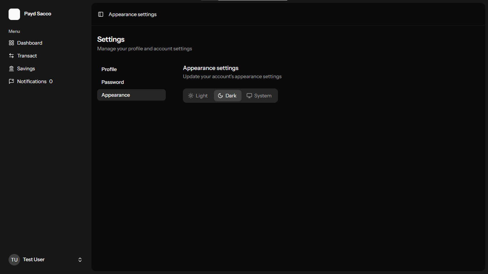

# Project Setup Guide

This guide outlines the steps to set up the project after cloning it from Github.

## Requirements

- PHP >= 8.2
- Composer
- Node.js and npm
- PostgreSQL/MySQL
- Laravel CLI (`php artisan`)
- Git

---

## 🚀 Getting Started

### 1. Clone the repository

```bash
git clone https://github.com/rono516/sacco.git
cd payd

```


# Linux Setup

```bash

cp .env.example .env
composer install
npm install

php artisan key:generate
```
- Setup database and run project

```bash
sudo -u postgres psql
CREATE DATABASE your_database_name;
\q

php artisan migrate --seed

php artisan serve

npm run dev

```

# Windows Setup

# Install dependencies

```bash
copy .env.example .env
composer install
npm install

```

# Generate app key
```bash
php artisan key:generate

```
# Create PostgreSQL database
- Use pgAdmin or psql:

```bash
CREATE DATABASE your_database_name;

```

- Update your .env file with your PostgreSQL username and password.

- Run migrations and seeders

```bash
php artisan migrate --seed

```
# Serve application

```bash
php artisan serve
```

# Build frontend assets
```bash
npm run dev
```

# Open in browser
[Visit Localhost On Browser](http://127.0.0.1:8000/)


# Product Thinking

Most clients of saccos for example Kenya Bankers Sacco are headed the direction of easening transactions for members, allowing them to monitor and transact from sacco operating account which is like a wallet, from this wallet they can deposit to other savings accounts, they can receive loans and withdraw from it.

Sacco is aiming to align to such easier banking solutions for sacco members, allowing them to transact with fellow members using wallet to wallet transfer, allowing them to deposit to the sacco, save in various saving accounts, check progress of their saving goals over time.

The members can receive real time app notifications of funds received in their wallet and they get a distinct wallet that they can use as their property for a long time without interference.

# Saving Features

- Create more than one saving goal
- Clear snapshot of all their savings at a go in the dashboard
- Saving Progress against target
- Deposit to savings from wallet


